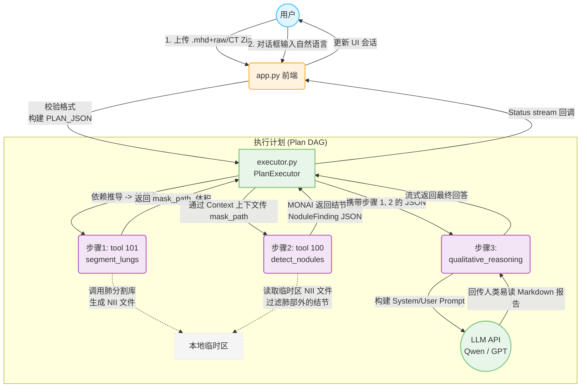

# MedClaw: 医学影像 AI 助手

---

## 1. README (项目概览)

MedClaw 是一个基于 Streamlit 构建的类 ChatGPT 医学影像 AI 助手 (v0.2.0)。该项目提供了一个包含“输入框+附件扩展”的对话界面，通过自动化三步工作流 (肺实质分割 → 肺结节检测 → 大模型医学总结) ，辅助用户或医生诊断输入的胸部 CT 影像。

### 核心特性：
- **类 ChatGPT 交互**：支持附件上传 (DICOM 序列/ZIP, `.nii.gz`, `.mhd/raw`)，支持连续式对话与流式过程看板。
- **自动工作流执行引擎**：内置 DAG 解析器 (`PlanExecutor`)，利用 `Plan JSON` 定义分析链 (执行包含定量分析与定性评价的任务)。
- **真实医学图像处理能力**：基于 lungmask 和 MONAI，提供高质量的分割及 3D RetinaNet 目标检测，支持 HU 窗值归一化与 Voxel/World 坐标系转换。
- **扩展性好**：将 ToolID 到目标核心函数的映射做了解耦。独立的模型微调脚本可利用 LUNA16 数据集不断提升表现能力。

### 快速启动：
```bash
# 安装依赖
pip install -r requirements.txt

# 启动服务
streamlit run app.py
```

---

## 2. 项目架构说明

项目采用类似于 **ReACT (Reasoning and Acting) Agent** 与 **有向无环图 (DAG) 工作流** 结合的混合架构。

- **前端展示层 (app.py)**：负责全局会话状态维护、环境变量加载与 UI 交互，充当人机交互的中枢。
- **核心执行调度层 (executor.py)**：包含 `PlanExecutor`。它读取预定义的 JSON 任务节点，执行 Kahn's Algorithm 拓扑排序解决任务之间 (如：结节检测依赖肺分割 mask) 的前置约束，并将参数无缝传递给下游。
- **能力工具层 (tools.py / llm_reasoner.py)**：提供底层执行动作。
    - **Tools**: 将复杂的模型推理 (CV) 抽象为含 ID 的独立工具 (如 `tool_101: segment_lungs`，`tool_100: detect_nodules`)，供调度层直接传参调用。
    - **LLM Reasoner**: 将工具的量化结果序列化为 JSON，构建 Prompt 注入给 LLM (如 qwen-plus等兼容 OpenAI 接口的模型)，输出对患者友好的自然语言医疗总结。
- **数据流规约层 (schemas.py)**：通过 Pydantic 规范 `PlanNode` 和处理逻辑各步之间的输入输出，从类型中约束数据。

---

## 3. 模块说明

| 模块文件 | 作用描述 | 开发者提示 |
| :--- | :--- | :--- |
| `app.py` | 交互入口；处理 UI、附件暂存解析，以及根据 JSON 定义任务触发`PlanExecutor`。 | 负责定义全局常量 `PLAN_JSON`，并流式渲染带有执行步骤(`StepStatus`)的消息回显。 |
| `executor.py` | 调度与路由控制器。进行 DAG 排序并调度方法调用。 | 它内置 `context` 字典，可提取之前任一模块的返回量（如提取 `mask_path` 后自动入参到后续模块中）。 |
| `tools.py` | OpenCV / ITK 医学图像工具集入口。 | 结合 SimpleITK 自动探测和读取 `.zip(DICOM) / .mhd` ，并包含分割、检测函数的具体实现代码和内存控制策略。 |
| `llm_reasoner.py` | 连接大语言模型 API 的定制化业务推理接口。 | 根据 `SYSTEM_PROMPT` 将检测坐标、体积大小等量化数据用简单准确的语言包裹起来。支持 fallback 兜底。 |
| `schemas.py` | JSON 和数据接口定义 (Pydantic)。 | 通过 `@model_validator` 严格保证 DAG json `depends_on` 逻辑完整、以及规定输出属性。 |
| `finetune_luna16.py` | 独立在 LUNA16 数据集上的 MONAI bundle 训练文件。 | 并非线上推理步骤。包含数据预处理、正负样本增强 (RandCropBox等)、混合精度优化流程。 |

---

## 4. 关键算法说明

本项目深度运用了目前医学图像最前沿的最佳实践：

### 1) 坐标系变换 (Image Loader & Core CV)
- **原理**：CT数据的本质是三维体素矩阵，由于病人方向、裁切方式等差异，每个矩阵有对应的物理原点 (Origin) 和间隙 (Spacing)。
- **实现**：算法强制使用 `World Coordinate` 进行标定。利用 `AffineBoxToWorldCoordinated` 将模型的直接切片框，变换为实际的物理毫米空间；利用 `TransformPhysicalPointToIndex` 又能变回 Mask 内的体素对假阳性结节做剔除过滤。

### 2) 肺实质分割 (Lung Segmentation, Tool 101)
- **技术栈**：基于 **lungmask** 框架内的 U-Net (默认采用 R231) 进行双肺实质分割输出 `NIfTI` 格式 `mask_path`。
- **量化处理**：通过 SimpleITK 在得到的 3D Mask 上，结合 Voxel Spacing，算数乘积得出单侧的肺容积(mL计) 返回给前台展示。

### 3) 肺结节 3D 目标检测 (Nodule Detection, Tool 100)
- **技术栈**：使用 **MONAI Model Zoo (lung_nodule_ct_detection)** 的 *RetinaNet 3D*。 Backbone 为 `ResNet50-FPN`。
- **优化点**：
    - **滑动窗口推理 (Sliding Window Inference)**：为避免 8GB 显卡显存 OOM，采用 `256 x 256 x 128` patch 大小局部检测最后裁剪合成。
    - **Mask 过滤机制 `_filter_by_lung_mask`**：由于 RetinaNet 的局限，会在非肺部位检测到很多假阳性。算法把输出的框通过 Inverse 矩阵再转回到 `lungmask` 去比对对应像素值，只留下肺里的真实病灶。

### 4) 有向无环图调度算法 (Kahn's Algorithm)
- 调度层对于无依赖或具有严格 `[1, 2]` 序列的步骤，能够依据图自动梳理好运行先后的 `execution_order`，保证工具数据输入链的一致性。

---

## 5. 调用流程图

以下是用 Mermaid 绘制的完整数据流与交互流过程（如法阅览，请安装 Mermaid 相关插件）：


